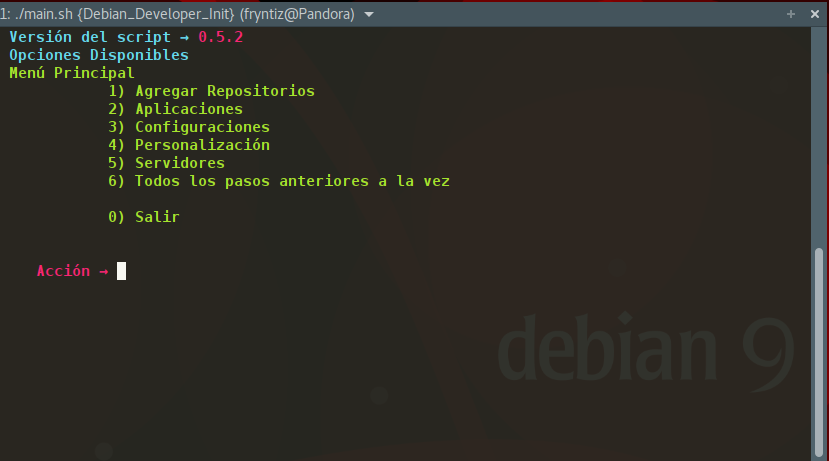
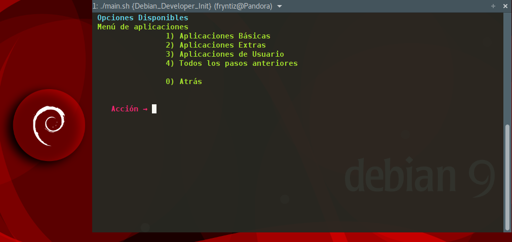

# Script para Preparar Entorno de Programación en Debian
Este script surge de la necesidad como desarrollador web para tener un entorno funcional en poco tiempo y además existir una concordancia entre las configuraciones de distintos dispositivos con los que trabajo.

Este script prepará completamente el entorno de programación, aplicaciones, servidores, plantillas y repositorios en Debian Stable.



Con la colaboración de un testeo constante por parte de @mavalroot (https://github.com/mavalroot).

Basado en el script original para otro Sistema Operativo de @ricpelo en esta dirección https://github.com/ricpelo/conf

Todas las configuraciones y elecciones se han establecido a mi gusto, puedes personalizar cualquier parte que decidas para este script.



## Estado
Este repositorio lo uso habitualmente a modo configuración personal y lo actualizo y actualizaré en el futuro.

En este momento tiene cierta estabilidad y la mayoría de los objetivos programados los cumple adecuadamente sin errores (aparentes claro está).

Si encuentras algún fallo o detectas que algo podría funcionar mejor, añade un **Issue** al que estaré encantado de atender y valorar.

También puedes colaborar con los PR que creas oportuno siempre que vaya en la línea del script y no sea necesario darle la vuelta a todo el proyecto.

En todo caso recomiendo usar la rama **Master** y si quieres colaborar crea un **fork** y haz **PR** sobre la rama **dev**

## Advertencias
Si no usas **repositorios oficiales** o usas repositorios mezclados con los oficiales usar este script es un **experimento** ya que no lo he probado ni tengo interés en ello. Podría funcionar bien (o no) así que úsalo bajo tu riesgo.

Este script está automatizado y puede cambiar configuración sin que te pregunte.

Una buena idea sería que lo ejecutaras tras hacer una copia de seguridad o en una máquina virtual hasta ver que el script completo se adapta a tus necesidades o modificar la parte que prefieras diferente. Trabajo en la modularidad para que puedas ejecutar solo una parte que te interese.

Para evitar que sea interactivo y estar constantemente preguntando se establece "-y" como parámetro por defecto en **apt** lo cual puede instalar software en forma de dependencia y/o romper en casos muy extremos el sistema, aunque repito que con repositorios oficiales no debe ocurrir nada extraño y si es así puedes reportarlo para su corrección.

En **ningún caso** me hago responsable de pérdidas de datos con el uso de esta herramienta ya que se ha diseñado en función a mis necesidades y la comparto para que puedas aprovechar parte o por completo la misma (Respetando la licencia GPLv3 que le he asignado).

## Objetivos
Crear un entorno de trabajo personalizado para desarrollar aplicaciones web según las preferencias del autor (https://github.com/fryntiz).

Se plantea lo más modular que me ha sido posible para que en algunos casos no sea necesario ejecutar el script completo y solo la parte que realmente necesitas (si fuese el caso).

Estos son los principales objetivos:

- Configurar terminales, bash y zsh
- Instalar tipografías
- Instalar editores Brackets, Atom, ninja IDE y Vim con sus personalizaciones
- Configurar sistema y variables globales
- Ampliar repositorios desde fuentes estables y fiables
- Instalar configuraciones y personalizaciones para el sistema y programas en el HOME
- Instalar atajos y personalizaciones para trabajar con git, GitHub y GitLab
- Instalar servidores Apache2, PostgreSQL, MariaDB
- Instalar lenguajes de programación, dependencias y librerías para → php, python, nodejs, ruby, bash, zsh
- Instalar Navegadores WEB para desarrolladores como Firefox Developer y Firefox Nightly
- Instalar herramientas para ayudar a debug en lenguajes web

## Distribución compatible
Está destinado única y exclusivamente para **Debian 9** (estable) y se irá actualizando con esta rama estable.

En otras ramas y distribuciones puede romper el sistema, para portarlo no hay demasiadas complicaciones y se deberá renombrar la instalación/nombre de paquetes si procede y establecer repositorios de acorde a la distribución. El resto de los pasos deberían ser idénticos.

Todo el script se basa en funciones.sh por lo que editando este archivo y adaptándolo a tu distribución podrás conseguir un cierto nivel de compatibilidad.

## Modularidad
Se ha intentado hacer modular de forma que apenas sea necesario tocar los scripts para añadir/quitar funciones.

La idea es que el script pregunte ciertas cosas como shell a usar (bash o zsh) pero también podemos añadir fuentes simplemente copiándolas al directorio "fonts" o instalar aplicaciones simplemente añadiéndolas a la lista de aplicaciones para instalar "Software.lst"

En las próximas versiones se plantea una Refactorización que permita manejar el script de forma aún más sencilla y además permita utilizar listas.lst donde el usuario introducirá un valor por línea para su configuración personalizada.

## Ejecutar script
Es importante realizar todos los pasos desde bash. Si usas **zsh** cambia a **bash** antes de ejecutarlo:
```bash
    bash
```

Primero instalamos GIT
```debian
    sudo apt install git
```

Clonamos el repositorio actual en nuestro equipo
```GIT
    git clone https://github.com/fryntiz/preparar_entorno
```

Entramos y ejecutamos el script principal
```bash
    cd preparar_entorno
    ./main.sh
```

## Personalización estética
Se han incorporados cambios en la personalización:
- Fondo de pantalla
- Grub
- GDM
- Iconos crystalblue

Además también se añadieron iconos "paper", temas "flatpat" y la instalación de cursores "crystal"

Todo esto se instalará de forma opcional eligiendo dicha opción en el menú. Por ahora se instalan pero se han de activar manualmente.

## Servidores
Se incorporan en la parte servidores instalación para apache2, php, postregsq, mariadb

### Apache 2
Se crean 3 servidores virtuales:

- Por defecto escuchando todo, con ruta /var/www/html
- Público como publico.local, con ruta /var/www/html/Publico
- Privado como privado.local, con ruta /var/www/html/Privado y contraseña creada/generada en /var/www/.htpasswd

Todos por el puerto estándar, 80

### PHP
En este script para seguir rigurosamente la filosofía **Debian** apostando por la seguridad que nos acostumbra y sobre todo la estabilidad la cual es bastante conocida, optamos a seguir siempre con la versión más alta de sus repositorios estables y oficiales libres.

Se instalan los siguientes paquetes básicos desde repositorios:
- php
- php-cli
- libapache2-mod-php

Se instalan los siguientes paquetes extras desde repositorios
- php-gd
- php-curl
- php-pgsql
- php-sqlite3
- sqlite
- sqlite3
- php-intl
- php-mbstring
- php-xml
- php-xdebug
- php-json

Se instala Composer y algunos paquetes con este
- composer


Se instalan las siguientes herramientas de fuentes externas:
- psysh → Un intérprete interactivo para aprender o hacer debug, incluyendo su documentación accesible una vez dentro del mismo intérprete usando la palabra reservada **doc** seguido de la función que solicitamos ayuda/información.

### PostgreSQL

### MariaDB

### Python
Contempla la instalación de Python2 y Python3 con sus gestores de paquetes **pip** para cada uno de ellos.

### NodeJS
Instala NodeJS (tienen que estar los repositorios agregados) y además contempla la instalación de algunos paquetes como ámbito global para poder corregir sintaxis javascript en algunos IDE's y/o desde terminal.

También instala desde **npm** bower y los siguientes paquetes globales:
- eslint
- jscs
- compass
- stylelint
- bundled

## Directorios
- Accesos_Directos → Contiene los accesos directos individuales para usuario que van en ~/.local/share/applications
- Apache2 → Contenido para apache
- Apps → Contiene scripts y configuraciones especiales para ciertas aplicaciones
- docs → Directorio con la documentación del proyecto e imágenes.
- fonts → Contiene un directorio por cada conjunto de fuentes similares
- gedit → Contiene configuración específica para gedit
- conf → Contiene archivos de configuración o plantillas para generarlos
- tmp → Directorio donde se descargan los archivos temporales, se crea al iniciar el script.
- sources.list → Contiene las listas (la mayoría de ellas) de repositorios que se añadiran al sistema cuando se elige la opción de agregar repositorios.
- usr → Contiene archivos compartidos de usuarios (temporalmente, se añadirá en el futuro dentro de conf)

# Scripts (La estructura está pendiente de completar Refactorización)
- Agregar_Repositorios.sh → Añade algunos repositorios útiles y sus llaves para seguridad
- funciones.sh →
- Instalar_Configuraciones → Genera todas las configuraciones de programas como Vim, Bashit, ohmyzsh y además añade configuraciones al sistema y el directorio home
- Limpiador.sh → Este script limpia los directorios y archivos que pueden causar más problemas en algún momento, esto existe para depurar principalmente y su uso se desaconseja por ser áltamente arriesgado a perder datos.
- main.sh → Programa principal con menú para elegir paso a realizar
- Servidores.sh → Instala servidores como apache2 php postregsql mariadb y los configura

Dentro de Apps/
- Atom_IDE.sh → Instala el editor ATOM con su configuración y complementos
- bashit.sh → Instala y configura Bash-it
- Brackets.sh → Instala y configura Brackets
- DBeaver.sh → Instala y configura DBeaver
- Firefox.sh → Instala la versión para desarrolladores **Quantum** y la versión en desarrollo principal **Nightly**
- GitKraken.sh → Instala y configura GitKraken
- Haroopad.sh → Instala y configura Haroopad
- i3wm.sh → Instala y configura gestor de ventanas i3wm
- Ninja-IDE.sh → Instala y configura Ninja IDE
- OhMyZsh.sh → Instala y configura OhMyZsh
- Pencil-Project.sh → Instala y configura Pencil Project
- vim.sh → Instala y configura Vim

Estructura pendiente de ordenar, alguna información extra:
- Configurar_GIT.sh → Scripts para configurar la integración de GIT, GitHub y GitLab
- Instalar_Software → Instala los programas indicados en la lista "Software.lst" y algunos extras
- Personalización_GTK.sh → Genera fondos para grub, escritorio, gdm... y además iconos, temas y cursores
- Tipografías.sh → Instala fuentes tipográficas
- Variables_Entorno.sh → Genera variables de entorno que seran globales en el sistema
