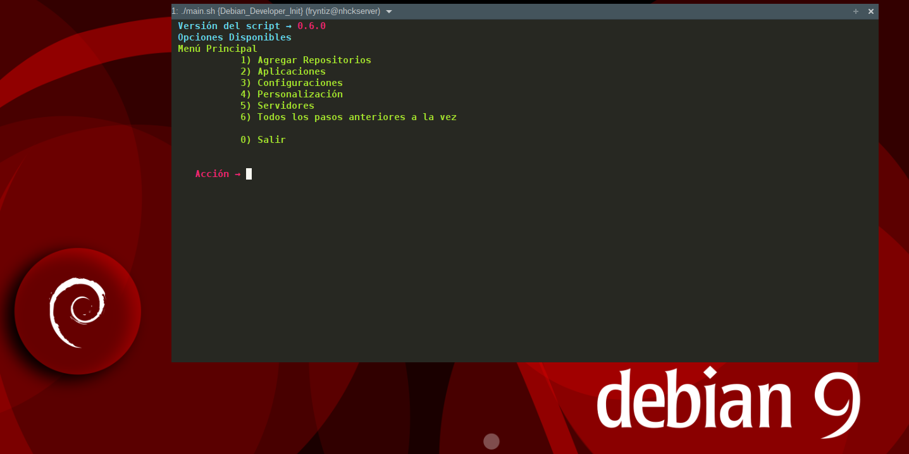
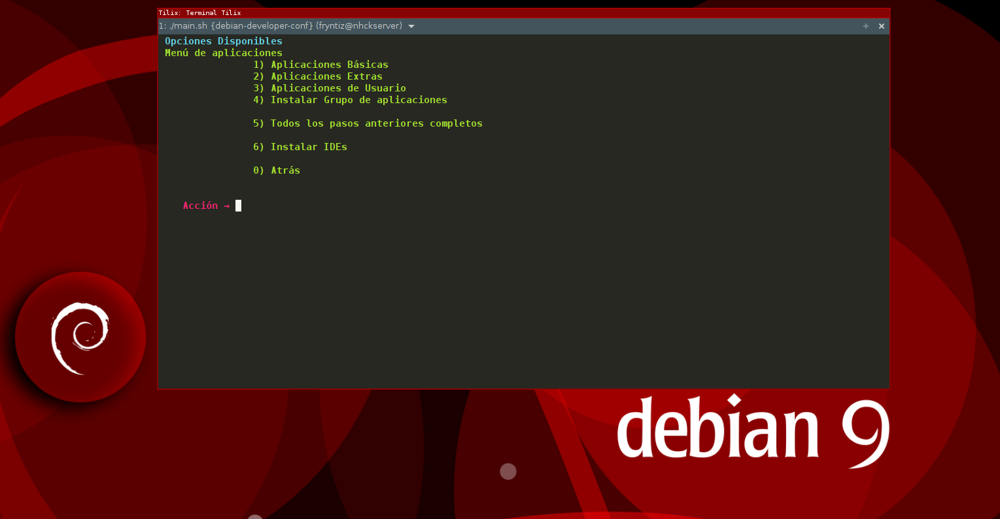
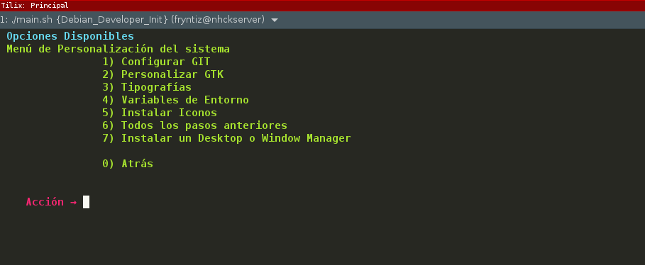
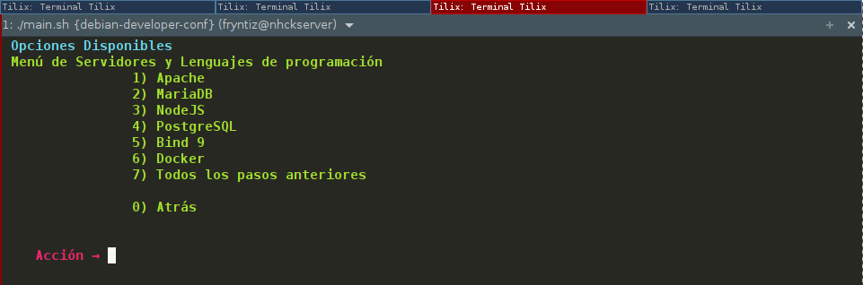
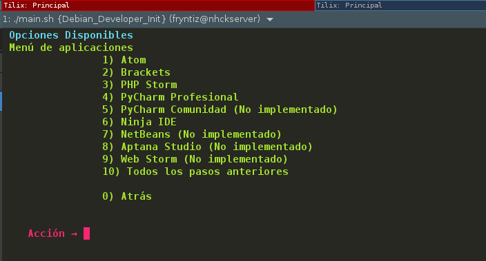
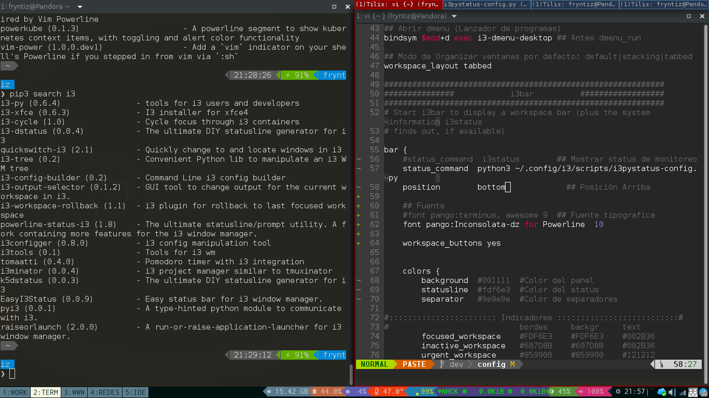
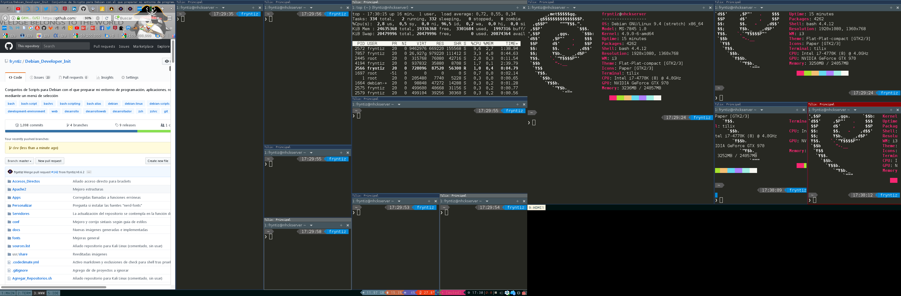

[](https://codeclimate.com/github/fryntiz/debian-developer-conf/maintainability)

# Script para Preparar Entorno de Programación en Debian

Script para tener un entorno funcional en poco tiempo y además tener
sincronizada la configuración de distintos dispositivos con los que trabajo.

Este script prepara completamente el entorno de programación, aplicaciones,
servidores, comandos personalizados, interfaz gráfica, plantillas y repositorios en Debian Stable.



Todas las configuraciones y elecciones se han establecido a mi gusto, puedes
personalizar cualquier parte que decidas para este script bajo la misma
licencia GPLv3.

Si encuentras algún fallo o detectas que algo podría funcionar mejor, añade un
**Issue** al que estaré encantado de atender y valorar.

También puedes colaborar con los PR que creas oportuno siempre que vaya en la
línea del script y no sea necesario darle la vuelta a todo el proyecto.

En todo caso recomiendo usar la rama **Master** y si quieres colaborar crea un
**fork** y haz **PR** sobre la rama **dev** para valorar si formará parte de
la siguiente versión.

## Advertencias y Explicación para decisiones

Si no usas **repositorios oficiales**, mezclas repositorios o tienes otro
sistema distinto a Debian Stable estarás **experimentando** así que úsalo bajo
tu riesgo.

Este script está automatizado y puede cambiar configuración sin que te pregunte.

Una buena idea sería que lo ejecutaras tras hacer una copia de seguridad o en
una máquina virtual hasta ver que el script completo se adapta a tus
necesidades o modificar la parte que prefieras diferente realizando un fork de
este repositorio.

Trabajo en la modularidad para que puedas ejecutar solo una parte que te
interese y no dependas del script al completo.

Para evitar que sea interactivo y estar constantemente preguntando se establece
"-y" como parámetro por defecto en **apt** lo cual puede instalar software en
forma de dependencia y/o romper en casos muy extremos el sistema, aunque repito
que con repositorios oficiales no debe ocurrir nada extraño y si es así puedes
reportarlo para su corrección.

## Objetivos

Crear un entorno de trabajo personalizado para desarrollar aplicaciones web
según las preferencias del autor (https://github.com/raupulus).

Se plantea lo más modular que me ha sido posible para que en algunos casos no
sea necesario ejecutar el script completo y solo la parte que realmente
necesitas (si fuese el caso).

Previsualización de menú para aplicaciones:



Estos son los principales objetivos:

- Configurar terminales, bash y zsh
- Instalar tipografías
- Instalar editores Brackets, Atom, ninja IDE y Vim con sus personalizaciones
- Instalar IDEs si el usuario lo elige
- Configurar sistema y variables globales
- Ampliar repositorios desde fuentes estables y fiables
- Instalar configuraciones y personalizaciones para el sistema y programas en
el HOME
- Instalar atajos y personalizaciones para trabajar con git, GitHub y GitLab
- Instalar servidores Apache2, PostgreSQL, MariaDB
- Instalar lenguajes de programación, dependencias y librerías para → php,
python, nodejs, ruby, bash, zsh
- Instalar Navegadores WEB para desarrolladores como Firefox Developer y
Firefox Nightly
- Instalar herramientas para ayudar a debug en lenguajes web
- Configurar interfaces gráficas

Previsualización de menú Personalización:



## Distribución compatible

Está destinado única y exclusivamente para **Debian 9** (estable) y se irá
actualizando con esta rama estable.

En otras ramas y distribuciones puede romper el sistema, para portarlo no hay
demasiadas complicaciones y se deberá renombrar la instalación/nombre de
paquetes si procede y establecer repositorios de acorde a la distribución. El
resto de los pasos deberían ser idénticos.

Todo el script se basa en funciones.sh por lo que editando este archivo y
adaptándolo a tu distribución podrás conseguir un cierto nivel de
compatibilidad.

## Modularidad

Se ha intentado hacer modular de forma que apenas sea necesario tocar los
scripts para añadir/quitar funciones.

La idea es que el script pregunte lo mínimo posible y que esto sean decisiones
relevantes.

## Ejecutar script

Es importante realizar todos los pasos desde bash. Si usas **zsh** cambia a
**bash** antes de ejecutarlo:

```bash
    bash
```

Primero instalamos GIT

```bash
    sudo apt install git
```

Clonamos el repositorio actual en nuestro equipo

```bash
    git clone https://github.com/raupulus/debian-developer-conf.git
```

Entramos y ejecutamos el script principal

```bash
    cd preparar_entorno
    ./main.sh
```

## Personalización

Agrega elementos gráficos al sistema, los configura para el usuario y activa.

- Fondo de pantalla
- Grub
- GDM
- Iconos
- Cursores crystalblue

Además también se añadieron iconos "paper", temas "flatpat" y la instalación de
cursores "**crystal**"

## Servidores

Se incorporan en la parte servidores instalación para apache2, postregsql,
mariadb, NodeJS, bind9 y docker.



### Apache 2

Se crean 3 servidores virtuales:

- Por defecto escuchando todo, con ruta /var/www/html
- Público como publico.local, con ruta /var/www/html/Publico
- Privado como privado.local, con ruta /var/www/html/Privado y contraseña
creada/generada en /var/www/.htpasswd

Todos por el puerto estándar, 80

### PHP

En este script para seguir rigurosamente la filosofía **Debian** apostando por
la seguridad que nos acostumbra y sobre todo la estabilidad la cual es bastante
conocida, optamos a seguir siempre con la versión más alta de sus repositorios
estables y oficiales libres.

Se instalan los siguientes paquetes básicos desde repositorios:

- php
- php-cli
- libapache2-mod-php

Se instalan los siguientes paquetes extras desde repositorios:

- php-gd
- php-curl
- php-pgsql
- php-sqlite3
- sqlite
- sqlite3
- php-intl
- php-mbstring
- php-xml
- php-xdebug
- php-json

Se instala Composer y algunos paquetes con este:

- composer

Se instalan las siguientes herramientas de fuentes externas:

- psysh → Un intérprete interactivo para aprender o hacer debug, incluyendo su
documentación accesible una vez dentro del mismo intérprete usando la palabra
reservada **doc** seguido de la función que solicitamos ayuda/información.

Se modifican los archivos de configuración para **Todas** las versiones de
PHP que se encuentren instaladas en el equipo. Estas modificaciones serán:

- timezone = 'UTC'
- error_reporting = E_ALL
- display_errors = On
- display_startup_errors = On
- max_execution_time = 180
- memory_limit = 128M
- upload_max_filesize = 512M
- post_max_size = 1024M

### PostgreSQL

Se instala la última versión stable de PostgreSQL (en el futuro se configuran
todas las versiones que pudieran estar instalada en el sistema), configura:

- intervalstyle = 'iso_8601
- timezone = 'UTC'

### MariaDB

Instala el cliente y el servidor para MariaDB (versión libre de MySQL)

También instala phpmyadmin para poder manipular/trabajar con estas bases de
datos de forma gráfica desde su interfaz web.

Una vez instalado plantea si quieres crear un usuario para desarrollar con el
nombre "**dev**" y con la contraseña en un principio "**dev**" dándole todos
los permisos de administración y manipulación a este usuario. No debe usarse
así en producción y se aconseja una vez finalizado el script cambiar la
contraseña de este usuario si habilitamos la posibilidad de conectar fuera de
localhost (para evitar que en sitios públicos puedan acceder, esto aún así es
poco probable además).

### Python

Contempla la instalación de Python2 y Python3 con sus gestores de paquetes
**pip** y **pip3**.

Además se instalan una serie de librerías normalmente recurridas.

### NodeJS

Instala NodeJS (tienen que estar los repositorios agregados) y además contempla
la instalación de algunos paquetes como ámbito global para poder corregir
sintaxis javascript en algunos IDE's y/o desde terminal.

También instala desde **npm** bower y los siguientes paquetes globales:

- eslint
- jscs
- compass
- stylelint
- bundled

## Lenguajes de Programación

Se plantea la instalación y configuración de los siguientes lenguajes:

- C
- C++
- go
- php
- python
- ruby
- nodejs

## Directorios

- Accesos_Directos → Contiene los accesos directos individuales para usuario
que van en ~/.local/share/applications
- Apache2 → Contenido para la estructura de apache
- Apps → Contiene scripts y configuraciones especiales para ciertas aplicaciones
- docs → Directorio con la documentación del proyecto e imágenes.
- fonts → Contiene un directorio por cada conjunto de fuentes similares
- Personalizar → Scripts para configurar la estética y comportamientos del sistema, cambiar fondos/temas/iconos/cursores y la instalación opcional de escritorios o window manager.
- conf → Contiene archivos de configuración o plantillas para generarlos
- tmp → Directorio donde se descargan los archivos temporales, se crea al
iniciar el script.
- Servidores → Instala y configura servidores.
- Lenguajes-Programacion → Instala y configura lenguajes de programación.
- Repositorios → Contiene las listas de repositorios para añadirlas al sistema 
cuando se elige la opción de agregar repositorios.
- Desktops → Instala y configura escritorios o window manager

# Scripts

- funciones.sh → Contiene funciones globales y auxiliares para no repetir código
- configuraciones.sh → Establece aplicaciones determinadas.
- limpiador.sh → Este script limpia los directorios y archivos que pueden
causar más problemas en algún momento, esto existe para depurar principalmente
y su uso se desaconseja por ser áltamente arriesgado a perder datos.
- main.sh → Programa principal con menú para elegir paso a realizar

Dentro de Apps/

## IDEs



  - Atom_IDE.sh → Instala el editor ATOM con su configuración y complementos
  - Brackets.sh → Instala y configura Brackets
  - Ninja-IDE.sh → Instala y configura Ninja IDE
  - aptanastudio.sh → (No implementado aún, en proceso)
  - netbeans.sh → (No implementado aún, en proceso)
  - phpstorm.sh → Instala y configura el IDE PhpStorm para Debian GNU/Linux
  - pycharm.sh → (No implementado aún, en proceso)
  - webstorm.sh → (No implementado aún, en proceso)
- bashit.sh → Instala y configura Bash-it
- DBeaver.sh → Instala y configura DBeaver
- Firefox.sh → Instala la versión para desarrolladores **Quantum** y la versión
en desarrollo principal **Nightly**
- GitKraken.sh → Instala y configura GitKraken
- Haroopad.sh → Instala y configura Haroopad
- i3wm.sh → Instala y configura gestor de ventanas i3wm
- OhMyZsh.sh → Instala y configura OhMyZsh
- Pencil-Project.sh → Instala y configura Pencil Project
- spacevim.sh → Instala y configura SpaceVim
- vim.sh → Instala y configura Vim

Estructura pendiente de ordenar, alguna información extra:

- Configurar_GIT.sh → Scripts para configurar la integración de GIT, GitHub y
GitLab
- Instalar_Software → Instala los programas indicados en la lista
"Software.lst" y algunos extras
- Personalización_GTK.sh → Genera fondos para grub, escritorio, gdm... y además
iconos, temas y cursores
- Tipografías.sh → Instala fuentes tipográficas
- Variables_Entorno.sh → Genera variables de entorno que seran globales en el
sistema

## Desktops y Windows Manager

Sección opcional que permite instalar y dejar configurado automáticamente el
estcritorio o window manager elegido.

Puedes leer más sobre los escritorios desde aquí:
https://github.com/raupulus/debian-developer-conf/Personalizar/Desktops/README.md

### i3 Window Manager

Instala y configura i3 Window Manager personalizando la barra de estado con i3pystatus y applets autoiniciados.





### Xmonad

### Openbox

## Comenzar con el script como usuario normal

```bash
cd $HOME
git clone https://github.com/raupulus/debian-developer-conf
```

## Comenzar con el script como root en vps

```bash
apt install git wget sudo
wget https://raw.githubusercontent.com/raupulus/debian-developer-conf/master/main-vps.sh -O /tmp/main-vps.sh
cd /tmp
chmod ugo+x main-vps.sh
./main-vps.sh
```
