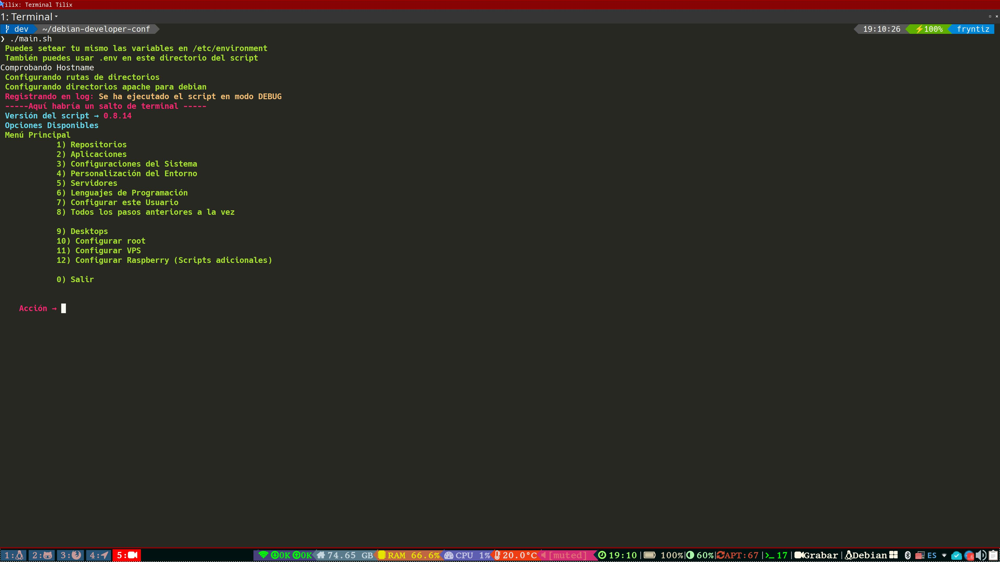
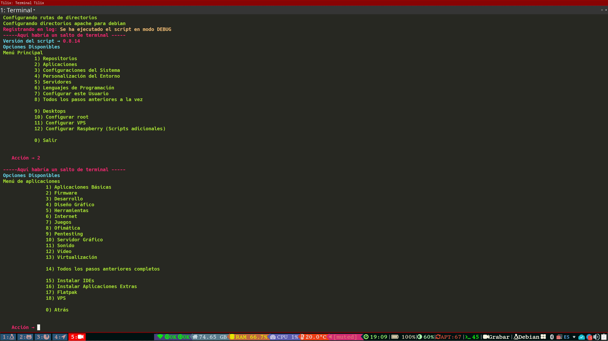
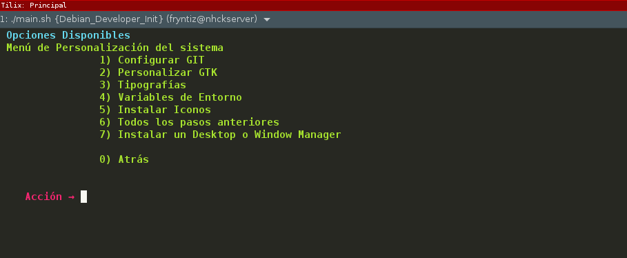
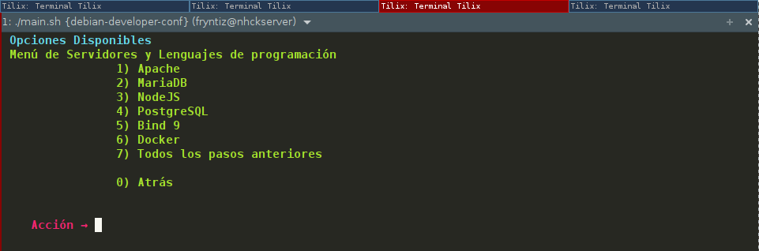
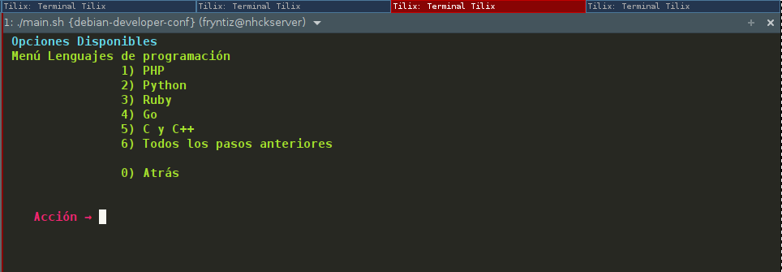
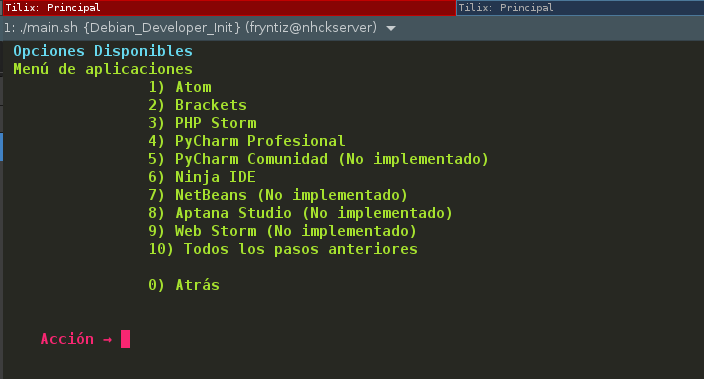
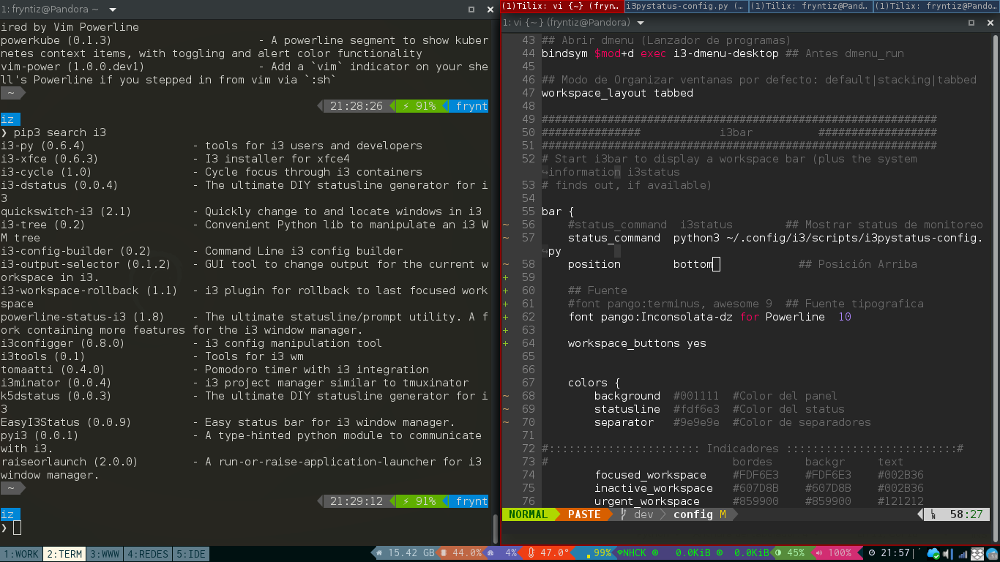
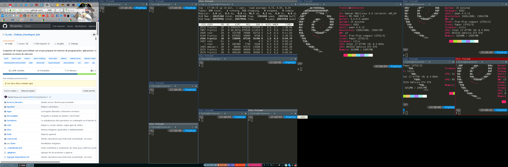

<!--
  PROPUESTA para sustituir el README.md de la RAÍZ del repositorio.
  Está aquí porque la herramienta que lo generó no tenía permiso de escritura
  en la raíz. Cuando lo des por bueno:  mv docs/README-raiz-propuesto.md README.md

  Cambios respecto al README actual, todos verificados contra el código:
    - Rama "Master" -> "main" (la rama Master ya no existe)
    - URL de wget de main-vps.sh apuntaba a /master/, daba 404
    - Añadido SteamOS como objetivo pendiente
    - Gentoo pasa de "experimental" a "no funcional" (verificado)
    - Retirado Python 2 (functions.sh lo tiene desactivado)
    - Marcados como heredados los globales npm muertos (bower, jscs, compass)
    - Nota sobre php-json (integrado en el core desde PHP 8)
    - Badge de CodeClimate: apuntaba a la organización antigua "fryntiz"
    - Enlaces a la documentación nueva de docs/info/
-->

# Script para Preparar Entorno de Programación

Script para tener un entorno funcional en poco tiempo y además mantener
sincronizada la configuración de los distintos dispositivos con los que
trabajo.

Prepara el entorno de programación, aplicaciones, servidores, comandos
personalizados, interfaz gráfica, plantillas y repositorios.



Todas las configuraciones y elecciones están puestas a mi gusto. Puedes
personalizar cualquier parte bajo la misma licencia GPLv3.

Si encuentras algún fallo o crees que algo puede funcionar mejor, abre un
**Issue**. Para colaborar, haz un **fork** y manda el **PR** contra la rama
`dev`.

## Advertencias

Este script está automatizado y **cambia configuración sin preguntar**.
Sobrescribe dotfiles y fuerza `-y` en apt, lo que puede arrastrar dependencias
y, en casos extremos, romper el sistema.

Ejecútalo tras una copia de seguridad, o en una máquina virtual, hasta
comprobar que se adapta a lo que necesitas.

Si mezclas repositorios o usas un sistema distinto a los soportados, estás
**experimentando**: úsalo bajo tu responsabilidad.

## Sistemas compatibles

| Sistema | Estado |
|---|---|
| **Debian Testing** | Referencia del proyecto. Es donde se prueba todo primero |
| **Debian Stable** | Soportado |
| **Debian Stable (VPS)** | Soportado. Variante con dependencias y hardening extra |
| **Raspberry Pi OS** | Soportado, pero con los repositorios desfasados |
| **Fedora** | Parcial y experimental |
| **macOS** | Parcial y experimental |
| **Gentoo** | **No funcional actualmente** |
| **SteamOS** | Pendiente de implementar |

El detalle de qué funciona en cada uno está en
[`docs/info/sistemas-objetivo.md`](docs/info/sistemas-objetivo.md).

Todo se apoya en `functions.sh`: adaptando ese fichero a tu distribución
consigues un nivel razonable de compatibilidad.

## Ejecutar el script

Hazlo todo desde **bash**. Si usas zsh, cambia antes:

```bash
bash
```

Instala git, clona el repositorio y ejecuta el script principal desde la raíz
del repo:

```bash
sudo apt install git
git clone https://github.com/raupulus/debian-developer-conf.git
cd debian-developer-conf
./main.sh
```

> `main.sh` usa `WORKSCRIPT=$PWD`, así que **tiene que ejecutarse desde la raíz
> del repositorio**.

### Como root en un VPS

```bash
apt install git wget sudo
wget https://raw.githubusercontent.com/raupulus/debian-developer-conf/main/main-vps.sh -O /tmp/main-vps.sh
cd /tmp
chmod ugo+x main-vps.sh
./main-vps.sh
```

`main-vps.sh` crea el usuario del sistema, clona el repositorio, desactiva IPv6
y continúa con `main.sh`.

### Configuración previa

Copia `env.example` a `.env` y ajusta los valores:

```
DISTRO=debian
BRANCH=stable
ENV=dev
ADMIN_EMAIL=admin@email.es
DEBUG=false
PATH_LOG="$WORKSCRIPT/errores.log"
```

Si no existe `.env`, el script pregunta en la primera ejecución y guarda las
respuestas en `/etc/environment`.

La combinación `BRANCH=stable` + `ENV=prod` activa la **variante VPS**.

## Objetivos

- Configurar terminales, bash y zsh
- Instalar tipografías
- Instalar y personalizar editores e IDEs
- Configurar el sistema y las variables globales
- Ampliar repositorios desde fuentes estables y fiables
- Instalar configuraciones y personalizaciones en el `$HOME`
- Instalar atajos y personalizaciones para git, GitHub y GitLab
- Instalar servidores: Apache2, PostgreSQL, MariaDB, Nginx, Docker
- Instalar lenguajes: PHP, Python, Ruby, Go, C/C++, Perl, NodeJS
- Instalar navegadores para desarrollo (Firefox Developer y Nightly)
- Configurar interfaces gráficas y window managers





## Estructura

El proyecto es modular: cada carpeta tiene su propio menú (`0_Main.sh`) y puede
ejecutarse sola.

| Directorio | Contenido |
|---|---|
| `Apps/` | Aplicaciones de todo tipo. Incluye `IDEs/` |
| `Repositorios/` | Repositorios de terceros por distro y rama |
| `configurations/` | Ajustes del sistema: crons, archivo hosts, scripts en el PATH |
| `Personalizar/` | Temas GTK/QT, iconos, Grub, fuentes, cursores |
| `servers/` | Apache, Nginx, MariaDB, PostgreSQL, Docker, etc. |
| `Lenguajes-Programacion/` | PHP, Python, Ruby, Go, C/C++, Perl, Android |
| `Usuario/` | Dotfiles, tmux, vim, shell |
| `Desktops/` | Escritorios y window managers (i3, Sway, Xmonad, Openbox, GNOME) |
| `root/` | Configuración del usuario administrador |
| `VPS/` | fail2ban, firewall, usuario admin, zona horaria |
| `raspberry/` | Optimizaciones para Raspberry Pi |
| `Software-Lists/` | Listas `.lst` de paquetes por distro |
| `Accesos_Directos/` | Ficheros `.desktop` para `~/.local/share/applications` |
| `fonts/` | Tipografías, un directorio por familia |
| `conf/` | Dotfiles maestros y scripts que van al PATH |
| `docs/` | Documentación e imágenes |
| `Backups/`, `tmp/` | Generados en tiempo de ejecución, no versionados |

## Scripts principales

| Script | Función |
|---|---|
| `main.sh` | Menú principal. Se ejecuta desde la raíz del repo |
| `main-vps.sh` | Bootstrap de VPS. Se ejecuta como **root** antes de clonar |
| `functions.sh` | Funciones globales y auxiliares |
| `routes.sh` | Rutas de Apache según la distribución |
| `preferences.sh` | Configuración interactiva inicial, persistida en `/etc/environment` |
| `limpiador.sh` | Limpieza agresiva. **Desaconsejado**: borra sin restaurar |
| `env.example` | Plantilla de `.env` |

`main.sh` admite atajos que saltan el menú: `./main.sh vim`, `./main.sh nano`,
`./main.sh terminals`.

## Servidores



### Apache 2

Crea tres virtual hosts, todos en el puerto 80:

- Por defecto, escuchando todo, en `/var/www/html`
- `publico.local` en `/var/www/html/Publico`
- `privado.local` en `/var/www/html/Privado`, protegido con `/var/www/.htpasswd`

### PHP

Se instala la versión más alta disponible en los repositorios oficiales de la
distribución. Paquetes básicos: `php`, `php-cli`, `libapache2-mod-php`.

Extras: `php-gd`, `php-curl`, `php-pgsql`, `php-sqlite3`, `sqlite3`, `php-intl`,
`php-mbstring`, `php-xml`, `php-xdebug`. También Composer y psysh.

> `php-json` figura en las listas por motivos históricos: desde PHP 8 está
> integrado en el core y el paquete ya no existe.

Se ajustan los `php.ini` de todas las versiones instaladas:

```
timezone = 'UTC'          error_reporting = E_ALL
display_errors = On       display_startup_errors = On
max_execution_time = 180  memory_limit = 128M
upload_max_filesize = 512M    post_max_size = 1024M
```

### PostgreSQL

Última versión estable, con `intervalstyle = 'iso_8601'` y `timezone = 'UTC'`.

### MariaDB

Cliente, servidor y phpMyAdmin. Ofrece crear un usuario `dev` con contraseña
`dev` y permisos totales.

> **Solo para entornos locales.** No lo uses así en producción, y cambia la
> contraseña si vas a permitir conexiones fuera de localhost.

### Python

Python 3 con `pip3`, más una serie de librerías habituales. Python 2 ya no se
contempla.

### NodeJS

Instala NodeJS (requiere tener los repositorios añadidos) y algunos paquetes
globales, como `eslint` y `stylelint`.

> Las listas conservan `bower`, `jscs` y `compass`, hoy abandonados. Están
> pendientes de retirar.

## Lenguajes de programación



C, C++, Go, PHP, Python, Ruby, Perl y Android.

## Personalización

Fondo de pantalla, Grub, GDM, iconos y cursores. Incluye iconos *Paper*, temas
*Materia/Flat-Plat* y cursores *crystalblue*.

## IDEs



En `Apps/IDEs/` se instalan y configuran PhpStorm, WebStorm, PyCharm Pro,
Android Studio, NetBeans y Arduino IDE. La lista actualizada está en
[`docs/info/apps.md`](docs/info/apps.md).

## Escritorios y window managers





i3, Sway, Xmonad, Openbox y GNOME Shell. Detalle en
[`docs/info/window-managers.md`](docs/info/window-managers.md) y
[`Desktops/README.md`](Desktops/README.md).

## Documentación

| Documento | Para qué |
|---|---|
| [`AGENTS.md`](AGENTS.md) | Reglas de trabajo y arquitectura. Fuente de verdad para agentes de IA |
| [`docs/info/indice.md`](docs/info/indice.md) | Índice de la documentación técnica |
| [`docs/info/sistemas-objetivo.md`](docs/info/sistemas-objetivo.md) | Matriz de sistemas y variante VPS |
| [`docs/info/auditoria-estado.md`](docs/info/auditoria-estado.md) | Estado real del código: qué está roto y qué no |
| [`docs/info/riesgos.md`](docs/info/riesgos.md) | Riesgos de diseño y problemas potenciales |

## Licencia

GPLv3. Ver [`LICENSE`](LICENSE).

## Autor

Raúl Caro Pastorino — [@raupulus](https://github.com/raupulus) —
<public@raupulus.dev> — <https://raupulus.dev>

Repositorio en GitHub: <https://github.com/raupulus/debian-developer-conf>
Espejo en GitLab: <https://gitlab.com/raupulus/debian-developer-conf>
